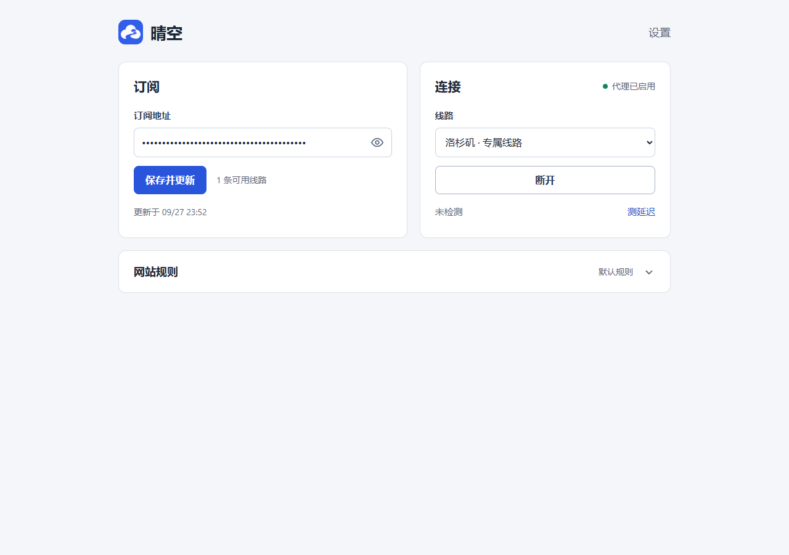
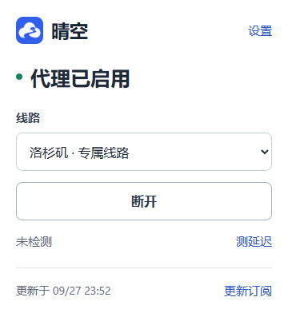

# Qingkong · Chrome Subscription Proxy

[中文](README.md)

A proxy extension for Chrome on Windows. Import a CLASH subscription, choose a node and connect. No extension account or local proxy core required.

## Features

- Manual node selection and one-click connect/disconnect.
- Smart routing with custom proxy and direct domains.
- Daily subscription and rule updates; preserve cached data on failure.
- Latency checks, automatic connectivity rechecks and connection restore after restart.

## Install

Installing and running the extension requires only **Chrome 120+**. Node.js is not needed.

Open `chrome://extensions` → enable **Developer mode** → **Load unpacked** → select the built extension directory (`dist/extension` in this project). To build from source, see [Development](#development).

## Use

1. Open extension settings, enter your HTTPS CLASH subscription URL, then save and refresh.
2. Select a browser node and click **Connect**.
3. Run the latency check to verify connectivity. After updating the extension, click **Reload** in Chrome's extension manager.

The subscription must include authenticated HTTPS proxy nodes (`type: http`, `tls: true`). VLESS-only subscriptions need the [server bridge](docs/DEPLOYMENT.md) first.

Subscriptions and credentials stay on your device. Proxy requests do not fall back to direct connections on failure; only browser traffic is covered. Enable **Allow in incognito** in extension details to use incognito windows.

## Screenshots





## Development

Building from source requires **Node.js 22+**. Run from the project root:

```powershell
npm ci --ignore-scripts --no-audit --no-fund
npm run build                   # Generate dist/extension
npm run pack                    # Generate CRX3 in releases/
python scripts/update-routing.py # Update bundled rules (Python 3.9+)
```

Windows Chrome may restrict CRX installation outside the Web Store; loading the unpacked directory is recommended. Keep the signing key in `signing/` safe.

[Server deployment](docs/DEPLOYMENT.md) · [Implementation](docs/IMPLEMENTATION.md) · [Third-party licenses](docs/THIRD_PARTY.md) — detailed documents are in Chinese.
