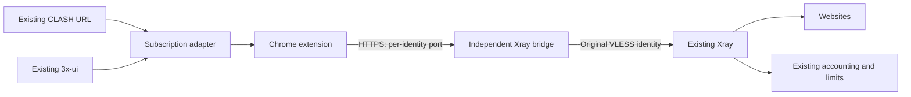

# Qingkong · Chrome Subscription Proxy / 晴空 · Chrome 订阅代理

**[English](README.en.md) | [中文](README.md)**

A Manifest V3 proxy extension for Chrome on Windows: import a CLASH subscription, choose a node, and use Smart routing without an extension account or a local proxy core.

**Version: 0.3.6** · **Chrome 120+** · **Node.js 22+** · **Python 3.9+**

## Overview

Qingkong uses Chrome's native HTTPS proxy support and PAC routing. Subscriptions containing only VLESS/TCP/REALITY nodes need a server bridge: the extension cannot run those protocols directly.

The companion service preserves the original nodes at each existing CLASH URL and adds a separate HTTPS browser endpoint for each original identity. Browser traffic passes through that identity's original VLESS node, so the existing 3x-ui installation continues to account for traffic and enforce account limits. Each identity has a stable, dedicated HTTPS port to isolate Chrome's proxy authentication cache.

## Features

- Import HTTPS CLASH YAML and select compatible HTTPS proxies from the top-level `proxies` list; connect and disconnect manually.
- Smart routing: local/private destinations and reserved domains → custom domain rules, with the most specific match first → sr_cnip rules in their original order. IPv4, IPv6 and mainland China address data are supported.
- Requests assigned to a proxy have no `DIRECT` fallback. If the selected node is removed, those requests remain blocked until another node is selected manually.
- Daily and manual subscription/rule updates; download or parsing failures preserve the last valid cache.
- Restore connection intent after a restart and report proxy control conflicts with extensions or policies. Disconnecting releases this extension's proxy settings.
- Manual latency measurement warms up the connection, then reports the median of three proxied HTTP requests. Connectivity results are separate from the proxy configuration status.
- After a confirmed detection failure, recheck every 30 seconds and clear warnings after recovery. The recovery task survives MV3 worker suspension; Chrome scheduling or device sleep may delay checks. Automatic checks do not generate manual latency values.
- Shared configuration for incognito windows, after enabling incognito access in Chrome's extension details.

## Quick start

Obtain the repository source and run these commands from its root with Node.js 22 or later:

```powershell
npm ci --ignore-scripts --no-audit --no-fund
npm run build
```

The build produces `dist/extension`. The routing snapshot is included in the source, so building does not require downloading routing data again.

1. Open `chrome://extensions` in Chrome and enable **Developer mode**.
2. Click **Load unpacked** and select this project's `dist/extension` directory.
3. Open the extension settings, enter your own HTTPS CLASH subscription URL, then save and refresh it.
4. Select a compatible browser node and connect. Run the latency check when you need to verify actual reachability.
5. After updating the unpacked directory, click **Reload** on the extension management page.

**Subscription requirement:** the top-level `proxies` list must contain a node with `type: http`, `tls: true`, a valid server and port, and its own username/password. A subscription with only raw VLESS nodes requires the server bridge first. Remote proxy-providers, disabled certificate verification, and SNI values different from the proxy host are unsupported.

Windows Chrome restricts CRX installation from sources outside the Web Store; Developer mode does not remove that restriction. The unpacked installation above is recommended.

## Screenshots

These screenshots use fictional example nodes. The current UI is in Chinese.


## Architecture



The browser machine needs only Chrome and the extension. The bridge runs on the server. Existing compatible HTTPS proxies can be imported directly without installing a local proxy core.

## Server and development

The server integration uses Python 3.9+, PyYAML, Xray, Caddy, and systemd/nftables. For Windows development, install the Python dependencies with:

```powershell
python -m venv .venv
.\.venv\Scripts\python.exe -m pip install -r server/requirements.txt
```

[`server/config.example.json`](server/config.example.json) contains a deployment template with placeholders. Adapt it to your environment and keep real configuration, the port registry, certificates and private keys in restricted server directories. The [deployment guide](docs/DEPLOYMENT.md) describes integration, failure behavior and rollback.

Run `python scripts/update-routing.py` to update the bundled routing snapshot. See the [routing update guide](docs/RULES-UPDATE.md) and [third-party notices](docs/THIRD_PARTY.md) for automatic publishing and licensing.

`npm run pack` builds the extension and uses a locally installed Chrome to create a CRX3 package in `releases/`. Set `CHROME_PATH` if Chrome is installed elsewhere. The first signing key is saved to `signing/qingkong.pem` and reused to keep the extension ID stable. Signing keys and generated packages are excluded from Git; build them locally.

## Repository layout

| Path | Purpose |
|---|---|
| `extension/src/` | MV3 background worker, parsing, PAC, routing, probes and UI |
| `extension/public/` | Manifest, HTML pages, styles and icons |
| `server/` | Read-only panel synchronization, subscription adaptation, Xray bridge and rule publishing |
| `scripts/` | Builds, CRX packaging and routing data updates |
| `checks/` | Focused logic checks and isolated Playwright browser checks |
| `docs/design/` | Requirements, terminology and architecture decisions |
| `docs/licenses/` | Third-party data licenses |
| `docs/screenshots/` | UI screenshots with fictional nodes |
| `dist/extension/` | Generated unpacked Chrome extension; excluded from Git |
| `work/` | Local temporary files and check artifacts; excluded from Git |
| `docs/reference/` | Local third-party research material; excluded from Git and product builds |

## Privacy and limitations

Subscription URLs, node credentials, custom rules and selections stay in `chrome.storage.local` and are not synchronized across devices. The extension has no content scripts and does not read web page DOM. Its access to all sites supports proxy authentication and subscription requests. Update requests go to the configured subscription service and routing data source.

Extension storage is not an encrypted vault: programs with access to the browser profile under the same Windows user may read it. Never commit real subscription paths, UUIDs, credentials, deployment configuration, port registries or signing keys.

The failure policy covers proxy requests controlled by this extension. It does not provide a system-wide kill switch; WebRTC, other applications and channels that bypass browser proxy settings are outside its scope. Mini mode, global mode, automatic node selection, testing all nodes and SUB imports are currently unavailable.

## Status and evidence

Historical records document companion server deployment and primary end-to-end acceptance on September 27, 2026. Those records describe that deployment and do not confirm the current live state. They include Chrome import, proxy egress, accounting isolation, account disabling, quotas and identity rotation; server reboot and real certificate renewal were not exercised.

The 0.3.6 recovery change has focused isolated Chrome evidence, without acceptance results from an everyday browser profile or a real network outage/recovery. The detailed technical documents are currently in Chinese:

- [Implementation and evidence boundaries](docs/IMPLEMENTATION.md)
- [Historical deployment results](docs/DEPLOYMENT-RESULT.md)
- [Historical routing deployment results](docs/RULES-DEPLOYMENT-RESULT.md)
- [0.3.6 recovery behavior](docs/NETWORK-RECOVERY-0.3.6.md)
- [Incognito usage](docs/INCOGNITO.md)
- [Requirements](docs/design/SPEC.md)

## Licensing and third-party material

Third-party code and data retain their own licenses; see [third-party notices](docs/THIRD_PARTY.md) and `docs/licenses/`. The converted sr_cnip rule list is licensed under CC BY-SA 4.0 and mainland China IP data under MIT. These data licenses do not apply to the project's independent program code, for which this repository currently declares no open-source license.

User-provided third-party CRX files and extracted source are research material and are excluded from both the product build and this repository.
