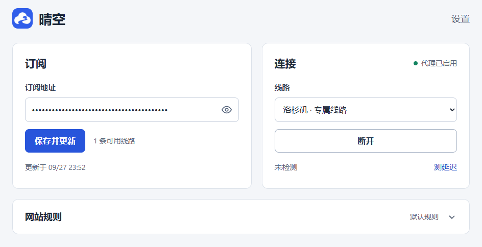

<p align="center">
  
</p>

<h1 align="center">晴空 · Qingkong</h1>

<p align="center">Chrome 订阅代理 · 手动选线 · Smart 分流</p>

<p align="center">
  <strong>简体中文</strong> · <a href="README.en.md">English</a>
</p>

导入自己的 CLASH 订阅，在 Chrome 中选择线路并连接。支持网站规则、自动更新和当前线路测速。

<table>
  <tr>
    <th width="70%">设置页</th>
    <th width="30%">弹窗</th>
  </tr>
  <tr>
    <td></td>
    <td></td>
  </tr>
</table>

## 功能

| 功能 | 说明 |
|---|---|
| 订阅管理 | 导入 CLASH，每日更新，失败保留上次配置 |
| 智能分流 | Smart 规则、IPv4 / IPv6、自定义代理与直连域名 |
| 连接控制 | 手动选线，一键连接与断开，重启恢复连接 |
| 网络检测 | 当前线路测速，异常后自动复查 |

## 快速开始

适用于 Windows 上的 **Chrome 120+**。扩展目录为 `dist/extension`，源码用户先按[本地构建](#本地构建)生成。

1. 打开 `chrome://extensions`，开启右上角的「开发者模式」。
2. 点击「加载已解压的扩展程序」，选择 `dist/extension`。
3. 打开晴空设置，粘贴自己的 HTTPS CLASH 订阅地址，点击「保存并更新」。
4. 在弹窗中选择线路，点击「连接」。

> 订阅需提供带认证的 HTTPS 代理节点。只有 VLESS / REALITY 节点的订阅，需要配套[服务器桥接](docs/DEPLOYMENT.md)。

## 常用操作

- **测速**：点击「测延迟」，检查当前线路的连通性。
- **更新扩展**：替换扩展文件后，在 `chrome://extensions` 点击「重新加载」。
- **无痕窗口**：在扩展详情中开启「在无痕模式下启用」。

订阅与凭据保存在本机。分流作用于 Chrome 代理请求，应代理的请求失败时不自动转为直连。

## 本地构建

使用 **Node.js 22+**，在项目根目录执行：

```powershell
npm ci --ignore-scripts --no-audit --no-fund
npm run build
```

输出目录：`dist/extension`。

<details>
<summary>打包与规则维护</summary>

```powershell
npm run pack                     # 生成 CRX3 到 releases/
python scripts/update-routing.py # 更新内置规则（Python 3.9+）
```

Windows Chrome 对非商店 CRX 有安装限制，推荐加载目录版。签名私钥保存在 `signing/`，后续打包应复用同一私钥。

</details>

[服务器部署](docs/DEPLOYMENT.md) · [实现说明](docs/IMPLEMENTATION.md) · [第三方许可](docs/THIRD_PARTY.md)
