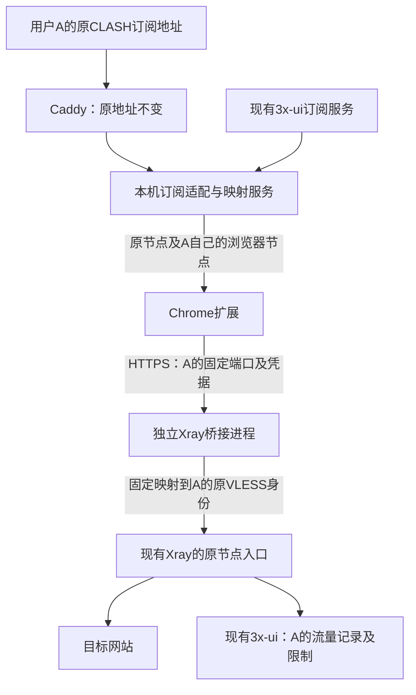

# Chrome 订阅代理实施规格

日期：2026-09-27。状态：用户已确认实施，并进一步授权部署与测试。项目位于 `D:\Yuanx\Code\Ai\ChromeSubscriptionProxy`。下文保留设计阶段的现场观察与部署规划；当前状态以 `../../README.md`、`../DEPLOYMENT-RESULT.md` 为准，线上已部署。

后续变更：用户委托主线程接入 sr_cnip.conf 自动更新分流，随后明确授权部署。0.3.0 的默认规则顺序、数据许可及单独新增的规则服务，以 `../RULES-UPDATE.md` 为准，部署结果见 `../RULES-DEPLOYMENT-RESULT.md`；此前的国内域名白名单方案已被替换。0.2.1 的界面精简和字号继续保留。

## 产品目标

在Windows Chrome中仅安装本扩展，粘贴各人现有的CLASH订阅地址即可导入并选择自己的浏览器节点，无需注册或登录插件账号，无需安装电脑端代理程序。服务器继续由现有3x-ui管理每人的原节点、用户身份、流量记录及额度/到期控制。

首版参考iGuge的连接、选线和Smart分流体验。浏览器使用标准HTTPS代理，由服务器桥接到该用户原有的VLESS/TCP/REALITY节点；订阅格式转换本身不承担协议转换。

## 已确认的功能范围

| 功能 | 首版行为 |
|---|---|
| 订阅格式 | CLASH；使用现有面板地址，不创建另一个订阅地址 |
| 原节点协议 | VLESS/TCP/REALITY优先，新增同类型节点也纳入映射；其它协议标记暂不支持 |
| 安装 | Windows Chrome开发者模式，加载已解压的扩展目录 |
| 登录 | 无插件注册/登录步骤；订阅地址和节点凭据承担访问授权 |
| 选线 | 手动选择导入的兼容节点 |
| 连接 | 一键启用/断开；显示真实配置状态，连通检测结果独立显示 |
| 分流 | 只做Smart，Mini和浏览器全局代理暂不纳入首版 |
| 域名规则 | 自定义代理/直连域名；相同域名不能同时属于两者 |
| 延迟 | 手动检测当前选中节点的实际代理请求延迟 |
| 自动选线 | 后续版本处理 |
| 缓存 | 本机保存最后有效订阅、选择、凭据、规则和连接状态，不跨设备同步 |
| 启动 | Chrome重启恢复此前连接状态；首次没有有效配置时不能连接 |
| 更新 | 每日自动更新，也可手动更新；更新失败保留最后有效配置并提示 |
| 节点失效 | 应代理的请求失败，不自动直连；本来直连的目标继续访问 |
| 节点被删除 | 提示手动重选，不自动换出口；同一节点凭据变化自动应用 |
| 代理冲突 | 仅提示，由用户处理；主动断开释放本扩展的代理设置 |

服务器供用户和朋友使用。任何订阅都只能得到自身原节点对应的浏览器节点，不能共享所有人的节点凭据。

## 最终架构

每个原节点身份使用一个稳定、独立的HTTPS代理端口。一个桥接进程可以承载全部这些入口，每个入口只接受该节点自己的凭据，并固定路由到对应原VLESS outbound；未匹配流量拒绝转发。

独立端口用于隔离Chrome的代理认证缓存。单个host:port上的不同有效账号可能复用先前缓存，仅靠onAuthRequired不能保证切换身份。Q21已经确认采用独立端口，不以清理用户cookies或全部连接作为选线机制。

所有浏览器流量必须实际经过原节点身份。桥接进程不并入主面板的流量抓取，主面板只统计原核心中的个人流量，避免重复记账。原额度与到期行为由原核心/面板执行；对已经建立的长连接如何处理，仍遵循原系统行为。

## 订阅与节点映射

1. 扩展仍请求每个人原来的CLASH地址。该URL的敏感路径不写入日志或交付文档。
2. Caddy把既有CLASH请求交给仅本机监听的适配服务；后者向原订阅服务取得该用户的输出。
3. 适配服务按有效用户和原节点建立映射，只补充对应的标准HTTPS浏览器节点。原VLESS节点和原配置仍保留，供其它客户端继续使用。
4. 每个浏览器节点含标准CLASH字段：名称、`type: http`、服务器、端口、用户名、密码和`tls: true`。不同用户或不同原节点不能误用同一映射。
5. 扩展从订阅节点中筛选自身支持的HTTPS节点；原始VLESS节点不能直接用于Chrome连接，界面需明确显示兼容数量及不兼容原因。
6. 无效、停用或不存在的订阅不得获得他人的浏览器节点。响应缓存不得跨用户共用。

首版扩展针对本服务器适配后的顶层 `proxies` 列表实现。远程proxy-provider递归拉取、任意CLASH脚本执行及其它客户端完整配置语义不属于本产品的导入能力。

账号/节点映射在服务器维护。面板新增、删除、停用用户或更换UUID后自动同步，目标一分钟内反映变化。凭据轮换随映射同步到订阅，扩展在下一次成功更新时应用；更新间隔内也可以手动刷新。原节点自身拒绝认证时，桥接不得绕开限制直接出网。

映射使用稳定身份，端口不得静默移交给另一用户。必要的桥接重载可能造成插件连接短暂重连，原VLESS核心不因桥接进程重载而重启。

## Smart分流

用户确认的业务顺序为：

1. 本机、回环和局域网直连。
2. 自定义域名规则。
3. 默认国内域名直连。
4. 中国大陆IP直连。
5. 其他以及无法判断的目标代理。

自定义域名包含自身和子域名；不同层级同时命中时采用更具体的域名规则。相同域名的代理/直连冲突必须显式解决。未知地址不默认直连。

实现默认约定：默认域名/IP数据随扩展包提供，首次运行即可使用；自定义规则本机持久保存。分流由本项目生成PAC，不加载iGuge的远端PAC或依赖其账号服务。订阅更新所需的HTTPS源域名列为保留直连目标，避免节点失效时连订阅更新也被阻塞。

失败策略只覆盖本扩展控制的浏览器代理流量，不宣称提供系统级断网保护。用户主动断开后，Chrome恢复原有代理控制。

## 界面与状态

- 弹窗：当前配置状态、节点选择、一键连接/断开、当前节点延迟检测、最近订阅更新时间、设置入口。
- 设置：订阅地址及刷新、导入结果、自定义直连/代理域名、简洁的错误说明。
- 状态区分：关闭、正在应用、代理已启用、配置失败、代理控制冲突、当前节点已被移除。手动连通检测另显示进行中、成功及失败。
- 不把已发送连接命令等同于连接成功，不把一次配置成功等同于所有网站可达，不把代理错误字符串猜成精确DNS/TCP/TLS根因。
- 0.3.6 起：检测确认异常后每 30 秒后台复查当前节点，成功清除提示并停止复查；弹窗关闭或后台休眠后继续恢复。主动断开或连接配置变化取消旧检测。自动复查不生成手动延迟结果，Chrome 调度可推迟执行。

插件认证回调只响应已配置代理端点的代理认证挑战；不向普通网站认证提供节点凭据。敏感数据保存在本机扩展存储，日志与错误输出脱敏，订阅不降级到HTTP。

## 服务器改动范围

下列是待实施的具体范围，当前均未创建或应用。

| 项目 | 计划 |
|---|---|
| 独立桥接核心 | 一个独立Xray进程，首版使用与现有节点兼容的版本 |
| HTTPS入口 | 同一域名 `bwh.yxzyl.cn`；每个原节点身份一个固定端口 |
| 当前端口规划 | 当前6个身份拟分配18443–18448；只开放实际分配端口，未来节点由映射服务分配并同步相应规则 |
| 订阅适配/映射管理 | 本机服务，拟监听127.0.0.1:2097，维护身份映射、桥接配置、凭据及变更同步 |
| 现有订阅上游 | 继续使用127.0.0.1:2096上的面板导出 |
| Caddy | 调整现有CLASH路径的转发目标；用户订阅URL不变 |
| TLS | 为新进程准备现有域名证书的受限副本及续期同步；不输出私钥 |
| 原用户管理 | 继续使用3x-ui原客户端身份、原VLESS/REALITY入口及原计量链路 |

HTTPS端口规划源于本轮监听端口清单，18443–18448和2097均未在该清单出现；这不是公网连通性证明。实际部署前仍需确认未被其他新工作占用，并把最终端口映射列入部署清单。

最终实现采用按入口固定映射到原身份的配置；不会让浏览器凭据自由指定任意其它用户的outbound，也不配置直接出网兜底。

## 当前证据与验收边界

当前已确认的事实：3x-ui版本3.8.5、Xray版本26.7.28；6个启用客户端身份对应6个不同订阅ID和6个不同email，已开启用户上传/下载统计。客户端身份数量不代表自然人数。指定订阅为CLASH YAML，现含1个VLESS/REALITY节点。现有面板不自动导出标准HTTPS节点。

官方源码支持HTTPS认证、入口路由、原VLESS身份计量及代理认证缓存隔离的设计结论。实际桥接连通性、用户流量归属和额度效果尚未验证，不能将源码分析视为运行验收。

进入实施并获相应授权后，完成本需求必需的最小验收：

- 原地址可导入该用户的浏览器节点，无法取得或使用他人的映射。
- 同一浏览器切换节点/订阅时，所选身份、实际出口和原面板计量归属一致。
- 浏览器流量使对应原用户的面板记录变化，其它用户不被错记；不要求计数与页面内容字节数完全相等。
- 原用户停用或额度限制生效后，应代理请求不能从桥接旁路继续访问；使用隔离的验收用户进行这类操作。
- Smart规则、失败不直连、订阅缓存、重启恢复、节点删除及代理冲突符合上表。

当前未执行上述运行验收，也未修改线上配置。

## 配套资料

- `CONTEXT.md`：术语表。
- `DESIGN.md`：访谈过程与决策树，最终行为以本规格为准。
- `docs/server-observation.md`：本轮服务器只读观察。
- `docs/subscription-observation.md`：订阅结构的脱敏观察。
- `docs/user-accounting-design.md`：用户计量与桥接机制、源码依据。
- `docs/proxy-auth-cache.md`：独立端口的原因与Chromium依据。
- `docs/adr/`：已经确认的关键架构决策。
