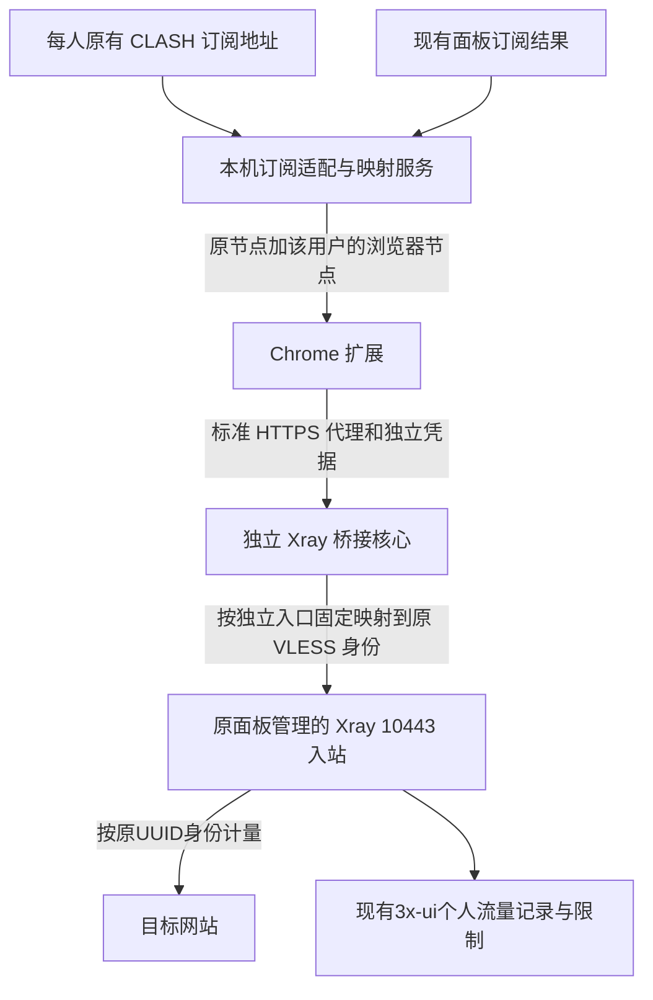

# 保留现有用户身份和计量的桥接设计

状态：Q18已确认桥接架构；Q19确认VLESS/TCP/REALITY优先；Q20确认自动同步身份变更；Q21以独立固定端口完成认证隔离。尚未实现、部署或进行连接测试。

## 实际计量基础

服务器Xray版本为26.7.28，已有6个启用客户端、6个不同订阅ID和6个不同email身份，client_traffics中有6行记录。当前均未设定正数流量额度或到期时间，但用户明确要求未来仍沿用面板原有额度与到期机制。

当前主核心已启用 `statsUserUplink`、`statsUserDownlink`、`statsUserOnline`。因此设计目标是让浏览器流量真正经过原客户端身份，而不仅是生成一个同名计数器。

## 方案

一个桥接核心维护多个使用TLS的HTTP入站，每个原节点身份使用稳定、独立端口及凭据；路由规则按入口固定选择该人的原VLESS/REALITY outbound，最后用黑洞规则拒绝未匹配流量。主面板只读取原核心统计，桥接核心不接入面板计数，防止同一转发链重复计量。

单端口多账户虽可通过用户名路由，但浏览器可能复用同地址的有效认证缓存，不能可靠支撑节点切换。Q21已选择独立端口；详见proxy-auth-cache.md。

原订阅URL保持不变。Caddy将该CLASH请求交给仅本机监听的适配服务；适配服务从原订阅服务读取对应用户的结果，保留原节点，只补充这些节点各自的浏览器兼容入口。任何订阅不得拿到别人的浏览器凭据。此处不同于面板全局inline provider共享一个节点。

## 拟新增的服务端范围

| 项目 | 设计范围 |
|---|---|
| HTTPS桥接入口 | 同一域名，每个原节点身份独立端口；当前6个身份拟用18443–18448，均未出现在本轮监听清单 |
| 订阅适配与映射服务 | 拟监听 `127.0.0.1:2097`；本轮未监听，不向公网直接开放 |
| 现有订阅上游 | `127.0.0.1:2096`，继续由当前面板产生原节点 |
| 原代理认证与计量 | 继续走原Xray的VLESS/REALITY身份和现有用户记录 |
| Caddy | 调整既有CLASH路径的本机转发目标，外部URL不变 |
| TLS证书 | 已找到当前域名证书及对应私钥；新服务需要受限副本和续期同步，不能假定服务账号能直接读取现有0600文件 |
| 身份映射 | 独立保存订阅/原节点/浏览器账号的对应关系，服务端自动同步，避免用户手工另填密码 |

尚未创建上述服务、账号、端口规则、证书副本或任何线上配置。

## 机制证据与边界

Xray26.7.28的HTTP入站在Basic认证成功后，把用户名写入 `inbound.User.Email`。路由支持用户身份和入站标签匹配；最终采用每个节点独立入站、固定outbound的方式，规则后添加拒绝兜底。

直接以同名HTTP用户给原面板加计数，不能证明面板停用VLESS客户端时也撤销HTTP账号；桥接方案通过原VLESS身份连接原入站，以复用原认证与限制链路。原有长连接在停用时的行为仍以原核心/面板为准，不额外承诺立即强制中断所有已建立连接。

这些是源码和现有配置支持的设计结论，不是完整链路的运行验收。未来实施必须分别确认每个用户的实际出口、用户隔离、原面板计数，以及停用/额度限制的表现；当前访谈阶段不执行这些检查。

## 已核实源码

- [HTTP身份绑定](https://github.com/XTLS/Xray-core/blob/v26.7.28/proxy/http/server.go)：Basic认证成功后用户名写入Inbound.User.Email。
- [HTTP账户模型](https://github.com/XTLS/Xray-core/blob/v26.7.28/infra/conf/http.go)：配置账户为user/pass。
- [Xray用户流量计数](https://github.com/XTLS/Xray-core/blob/v26.7.28/app/dispatcher/default.go)：按用户Email和policy创建上传/下载计数。
- [路由用户来源](https://github.com/XTLS/Xray-core/blob/v26.7.28/features/routing/session/context.go)与[规则匹配](https://github.com/XTLS/Xray-core/blob/v26.7.28/app/router/condition.go)：路由可以使用认证用户身份。
- [3x-ui计量写入](https://github.com/MHSanaei/3x-ui/blob/v3.8.5/internal/web/service/inbound_traffic.go)：按Email归入现有client_traffics。
- [3x-ui客户端停用](https://github.com/MHSanaei/3x-ui/blob/v3.8.5/internal/web/service/inbound_disable.go)：原客户端停用生命周期不等于撤销另加的HTTP accounts。
